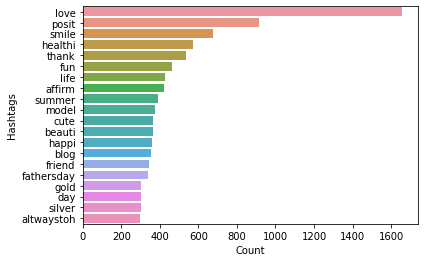

# Hi, I'm Anh Vu!
I'm a student athlete at McGill University studying Statistics and Computer Science.

You can find on this page various programming and data analytics projects that I've worked on:
* [Dog Breed Image Classifier](https://phamou.github.io/Portfolio/#1-dog-breed-image-classifier)
* [Twitter Sentiment Analysis](https://phamou.github.io/Portfolio/#2-twitter-sentiment-analysis)
* [Bulldozer Price Predictor](https://phamou.github.io/Portfolio/#3-bulldozer-price-predictor)
* [Heart Disease Predictor](https://phamou.github.io/Portfolio/#4-heart-disease-predictor)
* [Suicide Rates Analysis](https://phamou.github.io/Portfolio/#5-suicide-rates-analysis)

You can also find me on [LinkedIn](https://www.linkedin.com/in/anh-vu-pham/){:target="_blank"} and [GitHub](https://github.com/phamou){:target="_blank"}! 

# [1. Dog Breed Image Classifier](https://github.com/phamou/Image-Dog-Breed-Classifier/blob/master/good-boy-identifier.ipynb){:target="_blank"}
## Overview
Ever saw a dog, took a snapshot of it and wondered what breed it was? I did... a few too many times. This notebook applies deep learning methods to identify the breed of these cute fluffs and present my results through data visualization.

## Technologies and libraries used:
* TensorFlow
* TensorHub (MobileNetV2)
* NumPy
* Pandas
* Matplotlib

### Result visualization 

### Custom picked images to test external cases

# [2. Twitter Sentiment Analysis](https://github.com/phamou/Twitter-Sentiment-Analysis/blob/master/Twitter-Sentiment-Analysis.ipynb){:target="_blank"}
## Overview
Twitter is known for being extremely volatile. From life updates to strong political opinions, Millions of tweets are posted everyday. Using online datasets of past tweets, I will use NLP to further understand the content on this social media platform.

## Sections:
* Data Pre-Processing
* Data Visualization
* Extracting Features (Word Embedding):
* Data Modelling:
* Predicting Test Data Results
* Conclusion and Thoughts

## Technologies and libraries used:
* Scikit-Learn 
* NumPy
* Pandas
* Matplotlib
* WordCloud
* Seaborn

### WordCloud of common words in negative tweets 

### Top 20 most recurrent words in negative tweets

### Top 20 most recurrent words in positive tweets

### Comparing different models for best results

# [3. Bulldozer Price Predictor](https://github.com/phamou/Bulldozer-Price-Predictor/blob/master/bulldozer-price-regression.ipynb){:target="_blank"}
## Overview
The goal is to predict the sale price of a particular piece of heavy equipment at auction day based on its usage, equipment type, and configuration using regression and time series analysis. 

The biggest challenge of this project was to convert all data types to numerical values in order to be used in the Random Forest Regressor model.

## Technologies and libraries used:
* Scikit-Learn
* NumPy
* Pandas
* Matplotlib

### Feature importance of price predictor model

# [4. Heart Disease Predictor](https://github.com/phamou/Heart-Disease-Predictor/blob/master/heart-disease-classification.ipynb){:target="_blank"}
## Overview
Predicting heart-disease using machine learning (Classification).
This notebook will look into using Python-based ML and data science libraries in an attempt to build a ML model capable of predicting whether someone has heart disease or not based on their medical record.

The problem will be divided in these different sections:

1. Problem definition
2. Data
3. Evaluation
4. Features 
5. Modelling 
6. Experimentation

This notebook features many visualization tools to understand possible correlations.

## Technologies and libraries used:
* Scikit-Learn
* NumPy
* Pandas
* Matplotlib

### Correlation matrix of all the features

### Scatter plot of maximum heart rate and age

### Bar graph between sex and heart disease frequency

# [5. Suicide Rates Analysis](https://github.com/phamou/Suicide-Rates-Analysis/blob/master/Suicide-Rate-Analysis.ipynb){:target="_blank"}
## Overview (PROJECT IN PROGRESS)
From star celebrities, respected chefs and renowned designers like Robin Williams, Anthony Bourdain and Kate Spade, I realized that suicidal thoughts do not discrimate based on success. It is even scarier to know that mental health problems can hide in plain sight, even to those suffering from it. I came across an article from Time magazine that suicide rates have been on the rise in the United States since the 21st century and it is at its highest since WWII.
Is Canada as heavily affected by these numbers? Why is there a sudden sharp increase in suicide rates? I hope to be able to learn about the factors influencing the rise in numbers around the world. 

## Technologies and libraries used:
* Tableau
* NumPy
* Pandas

### [Dashboard on suicide rates around the world](https://public.tableau.com/views/Suicideworldmap/Dashboard2?:language=en&:display_count=y&:origin=viz_share_link){:target="_blank"} 

<noscript></noscript><object class='tableauViz'  style='display:none;'><param name='host_url' value='https%3A%2F%2Fpublic.tableau.com%2F' /> <param name='embed_code_version' value='3' /> <param name='path' value='views&#47;Suicideworldmap&#47;Dashboard2?:language=en&amp;:embed=y&amp;:display_count=y&amp;publish=yes' /> <param name='toolbar' value='yes' /><param name='static_image' value='https:&#47;&#47;public.tableau.com&#47;static&#47;images&#47;Su&#47;Suicideworldmap&#47;Dashboard2&#47;1.png' /> <param name='animate_transition' value='yes' /><param name='display_static_image' value='yes' /><param name='display_spinner' value='yes' /><param name='display_overlay' value='yes' /><param name='display_count' value='yes' /><param name='language' value='en' /><param name='filter' value='publish=yes' /></object>
  

### [Dashboard on suicide numbers by generation](https://public.tableau.com/views/Suicidespergeneration/Dashboard1?:language=en&:display_count=y&:origin=viz_share_link){:target="_blank"} 
 
<noscript></noscript><object class='tableauViz'  style='display:none;'><param name='host_url' value='https%3A%2F%2Fpublic.tableau.com%2F' /> <param name='embed_code_version' value='3' /> <param name='site_root' value='' /><param name='name' value='Suicidespergeneration&#47;Dashboard1' /><param name='tabs' value='no' /><param name='toolbar' value='yes' /><param name='static_image' value='https:&#47;&#47;public.tableau.com&#47;static&#47;images&#47;Su&#47;Suicidespergeneration&#47;Dashboard1&#47;1.png' /> <param name='animate_transition' value='yes' /><param name='display_static_image' value='yes' /><param name='display_spinner' value='yes' /><param name='display_overlay' value='yes' /><param name='display_count' value='yes' /><param name='language' value='en' /><param name='filter' value='publish=yes' /></object>

       
       
       

    
